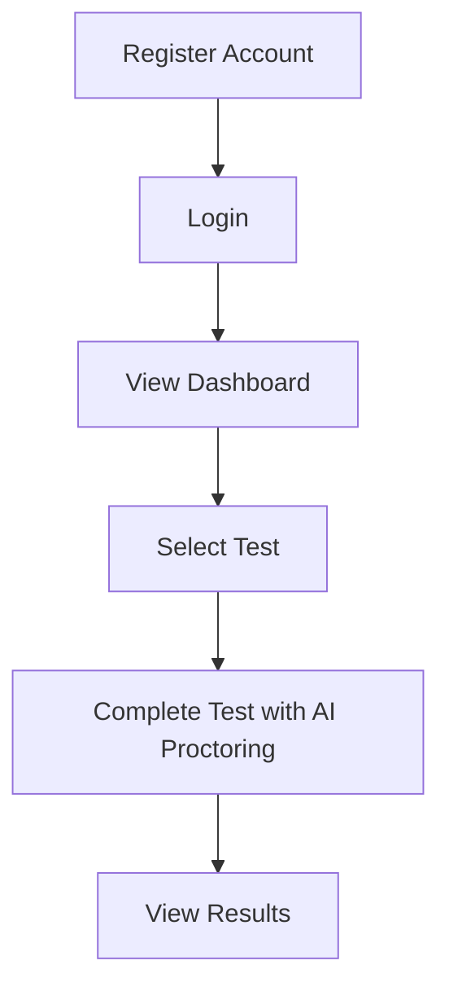
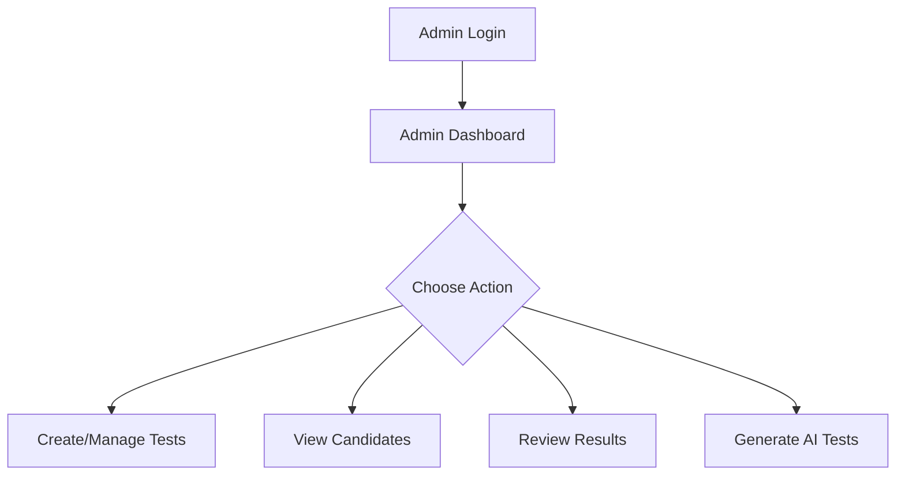

<div align="center">

# 🎓 AI Proctoring System

### Advanced Web-Based Examination Platform with AI-Powered Proctoring


**[Features](#-features)** • **[Demo](#-demo)** • **[Tech Stack](#️-tech-stack)** • **[Installation](#-installation)** • **[Usage](#-usage)** • **[Contributing](#-contributing)**


</div>

---

## 📌 Overview

A **comprehensive web-based examination platform** designed to maintain exam integrity through **advanced AI-powered proctoring**. This system combines modern web technologies with cutting-edge artificial intelligence to create a secure, efficient, and user-friendly testing environment.

<details>
<summary><b>🎯 Why Choose This System?</b></summary>

- ✅ **Advanced AI Monitoring** - Real-time face detection and behavior analysis
- ✅ **Automated Test Generation** - Create tests using Google Gemini AI
- ✅ **Comprehensive Analytics** - Detailed insights into exam performance
- ✅ **Modern UI/UX** - Beautiful, responsive design with dark mode
- ✅ **Secure & Scalable** - Built with industry-standard security practices

</details>

---

## ✨ Features

<table>
<tr>
<td width="50%">

### 👤 For Candidates

- 🔐 **Secure Registration** - Complete profile setup with personal information
- 📊 **User Dashboard** - View profile, available tests, and test history
- ✏️ **Profile Management** - Edit personal information anytime
- 🤖 **AI-Monitored Testing** - Real-time proctoring during exams
- 📱 **Enhanced Exam UI** - One-question-per-page with progress tracking
- 📈 **Results Tracking** - Detailed performance analytics

</td>
<td width="50%">

### 👨‍💼 For Administrators

- 📝 **Test Management** - Create, publish, unpublish, and delete tests
- 🧠 **AI Test Generation** - Auto-generate questions using Google Gemini
- 👥 **Candidate Oversight** - View all registered candidates with profiles
- 📊 **Results Monitoring** - Access comprehensive analytics
- 🔧 **User Management** - Manage candidate accounts and permissions
- 🗑️ **Delete Functionality** - Remove tests and results as needed

</td>
</tr>
</table>

### 🎯 AI Proctoring Capabilities

<div align="center">

| Feature | Description | Status |
|---------|-------------|--------|
| 👁️ **Face Detection** | Real-time facial recognition using advanced AI | ✅ Active |
| 🔄 **Tab Switching Detection** | Monitors browser tab changes | ✅ Active |
| 🎤 **Audio Monitoring** | Detects background noise and suspicious audio | ✅ Active |
| 📝 **Violation Logging** | Automatic recording of proctoring violations | ✅ Active |
| 🚨 **Real-time Alerts** | Immediate notifications for suspicious activities | ✅ Active |
| 📋 **Proctoring Logs** | Detailed logs of all proctoring events | ✅ Active |

</div>

---

## 🛠️ Tech Stack

<div align="center">

### Frontend


### Backend


### AI & Security


</div>

<details>
<summary><b>📚 Complete Technology List</b></summary>

**Frontend:**
- React - Modern JavaScript library for building user interfaces
- React Router - Declarative routing for React applications
- Tailwind CSS - Utility-first CSS framework
- Framer Motion - Production-ready motion library for React
- Face-API.js - JavaScript API for face detection and recognition

**Backend:**
- Node.js - JavaScript runtime built on Chrome's V8 engine
- Express.js - Fast, unopinionated, minimalist web framework
- MongoDB - NoSQL document database
- Mongoose - Elegant MongoDB object modeling for Node.js
- JWT - JSON Web Tokens for authentication
- bcrypt - Password hashing library

**Additional Libraries:**
- Axios - Promise-based HTTP client
- React Icons - Popular icons library
- Web Audio API - Audio processing for noise detection
- Google Generative AI - AI-powered test question generation

</details>

---

## 📋 Prerequisites

Before running this application, ensure you have:

```bash
✓ Node.js (version 14 or higher)
✓ MongoDB (local installation or MongoDB Atlas)
✓ Git (for cloning the repository)
✓ Google Generative AI API Key
```

---

## 🚀 Installation

### 1️⃣ Clone the Repository

```bash
git clone https://github.com/Abhinandan46/Proctoring-System.git
cd Proctoring-System
```

### 2️⃣ Install Server Dependencies

```bash
cd server
npm install
```

### 3️⃣ Install Client Dependencies

```bash
cd ../client
npm install
```

### 4️⃣ Environment Setup

Create a `.env` file in the `server` directory:

```env
MONGO_URI=your_mongodb_connection_string
JWT_SECRET=your_jwt_secret_key
GOOGLE_AI_API_KEY=your_google_generative_ai_api_key
```

> 💡 **Tip:** Use MongoDB Atlas for a cloud-based database solution

### 5️⃣ Start MongoDB

Ensure MongoDB is running on your system or configured in your `.env` file.

---

## 🎮 Running the Application

### 🔧 Development Mode

**Terminal 1 - Backend Server:**
```bash
cd server
npm start
# Server runs on http://localhost:5000
```

**Terminal 2 - Frontend Client:**
```bash
cd client
npm start
# Client runs on http://localhost:3000
```

### 🏭 Production Build

```bash
# Build the client
cd client
npm run build

# Start production server
cd ../server
npm start
```

---

## 📖 Usage

<table>
<tr>
<td width="50%">

### 👤 **Candidate Workflow**



1. **Register** - Create account with complete profile
2. **Login** - Access your personalized dashboard
3. **Take Tests** - Complete exams under AI supervision
4. **View Results** - Check scores and performance history

</td>
<td width="50%">

### 👨‍💼 **Administrator Workflow**



1. **Login** - Access admin dashboard
2. **Manage Tests** - Create, publish, or unpublish tests
3. **Monitor Candidates** - View all registered users
4. **Review Results** - Analyze performance and proctoring data

</td>
</tr>
</table>

---

## 🔒 Security Features

<div align="center">

| Security Layer | Implementation | Purpose |
|----------------|----------------|---------|
| 🔐 **Authentication** | JWT Tokens | Secure session management |
| 🔑 **Password Security** | bcrypt Hashing | Encrypted password storage |
| 👥 **Authorization** | Role-Based Access | Separate admin/candidate permissions |
| ✅ **Validation** | Client & Server Side | Input sanitization and validation |
| 🤖 **AI Proctoring** | Multi-layer Detection | Advanced cheating prevention |

</div>

---

## 🎨 UI/UX Highlights

<div align="center">

🌈 **Modern Design** • 🌙 **Dark Mode** • 📱 **Responsive Layout** • ✨ **Smooth Animations** • 🎯 **Intuitive Navigation**

</div>

- **Glassmorphism Effects** - Beautiful backdrop blur and modern aesthetics
- **Complete Dark/Light Theme** - Comfortable viewing in any environment
- **Mobile-Friendly** - Seamless experience across all devices
- **Framer Motion Animations** - Smooth, professional transitions
- **Unified Design Language** - Consistent styling across components

---

## 🤝 Contributing

We love contributions! Follow these steps:

1. 🍴 **Fork** the repository
2. 🌿 **Create** a feature branch
   ```bash
   git checkout -b feature/AmazingFeature
   ```
3. 💾 **Commit** your changes
   ```bash
   git commit -m 'Add some AmazingFeature'
   ```
4. 📤 **Push** to the branch
   ```bash
   git push origin feature/AmazingFeature
   ```
5. 🎉 **Open** a Pull Request

### 📝 Contribution Guidelines

- Follow the existing code style
- Write meaningful commit messages
- Add tests for new features
- Update documentation as needed

---

## 📄 License

This project is licensed under the **MIT License** - see the [LICENSE](LICENSE) file for details.

---

## 🙏 Acknowledgments

<div align="center">

Special thanks to these amazing technologies and communities:

**Face-API.js** • **React Community** • **MongoDB** • **Google Gemini AI** • **Open Source Community**

</div>

---

## 📞 Support & Contact

<div align="center">

💬 **Need Help?**

[Open an Issue](https://github.com/Abhinandan46/Proctoring-System/issues) • [Discussions](https://github.com/Abhinandan46/Proctoring-System/discussions)

⭐ **If you find this project useful, please give it a star!**

</div>

---

## 🗺️ Roadmap

- [ ] Multi-language support
- [ ] Advanced analytics dashboard
- [ ] Mobile app development
- [ ] Video recording during exams
- [ ] Integration with LMS platforms
- [ ] Enhanced AI models for better detection

---

<div align="center">

**Built with ❤️ for Education**

⚠️ **Note:** This system is designed for educational purposes and should be used in accordance with institutional policies and regulations.

---

**[⬆ Back to Top](#-ai-proctoring-system)**

</div>